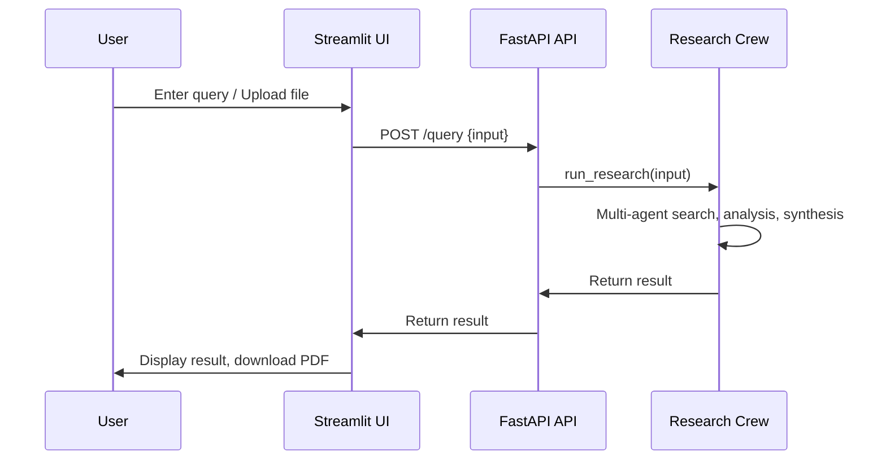

# Agentic Deep Researcher

A web-based research assistant that combines a FastAPI backend and a Streamlit frontend, orchestrating multi-agent research workflows to answer complex queries and generate detailed reports.

---

## 🚀 Setup Instructions

### 1. Clone the Repository
```bash
git clone <your-repo-url>
cd deep-research
```

### 2. Sync Dependencies with uv
```bash
uv sync
```

### 3. Environment Variables
Copy the example file and fill in your secrets:
```bash
cp .env.example .env
```
Edit `.env` and provide your actual API keys and settings.

### 4. Run the Backend (FastAPI)
```bash
uv run api:app --reload --port 8000
```

### 5. Run the Frontend (Streamlit)
```bash
uv run streamlit run app.py
```

---

## 🛠️ Technical Overview and Key Components

- **`api.py`**: FastAPI backend exposing `/query` (main research endpoint) and `/status` (health check).
- **`app.py`**: Streamlit UI for uploading files, entering queries, and viewing/downloadable results.
- **`agents.py`**: Orchestrates multi-agent research crews, using LLMs and web search tools (e.g., LinkUp).
- **File Upload & Extraction**: Supports images, PDFs, and DOCX. Extracted content is included in queries.
- **PDF Generation**: Converts markdown research output to downloadable PDF.

---

## 🏗️ System Architecture

```mermaid
graph TD
    A[User] -- Query/File --> B[Streamlit UI (app.py)]
    B -- API Call --> C[FastAPI Backend (api.py)]
    C -- Orchestrate --> D[Research Crew (agents.py)]
    D -- Web Search/LLM --> E[External APIs (LinkUp, Gemini)]
    D -- Result --> C
    C -- Result --> B
    B -- Display/Download --> A
```

---

## 🔄 Solution Workflow



---

## 🧪 Sample Inputs/Outputs

### API Example
**Request:**
```json
POST /query
{
  "input": "What are the latest advances in quantum computing?"
}
```
**Response:**
```json
{
  "result": "1. Executive Summary: ...\n2. Key Findings: ... [1] ... [2] ..."
}
```

### UI Example
- **Input:** User enters a research question and/or uploads a PDF.
- **Output:**
  - Detailed markdown report displayed in the UI
  - Option to download the report as a PDF

---

## 📈 Notes
- The system requires valid API keys for Gemini and LinkUp.
- Supported file types: png, jpg, jpeg, pdf, docx.
- For more details, see comments in `app.py`, `api.py`, and `agents.py`.

---

## 📬 Contact
For questions or support, please open an issue or contact the maintainer.
