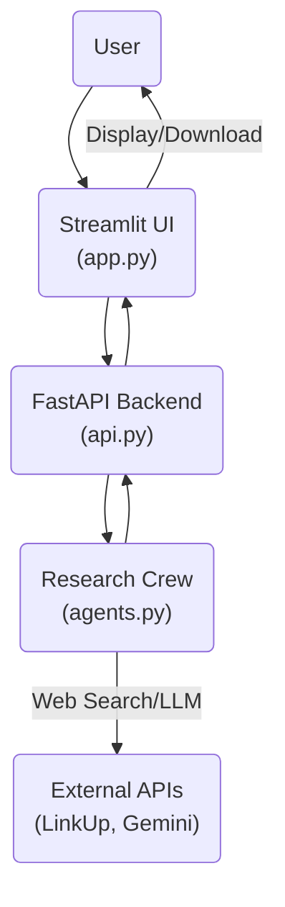
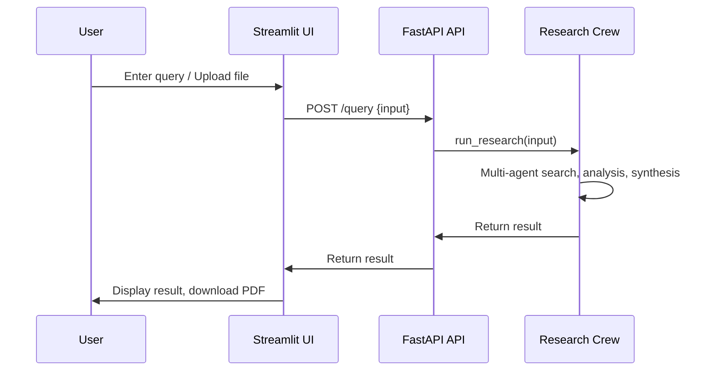

# Agentic Deep Researcher

A web-based assistant that delivers deep research answers by combining real-time information retrieval with LLM knowledge.

---

## 🚀 Setup

### Installing `uv` (Python package manager)

This project uses [`uv`](https://github.com/astral-sh/uv) for fast dependency management. If you don't have `uv` installed, follow the steps below:

#### 1. Check if you have `uv` installed:

```bash
uv --version
```
If you see a version number, you already have `uv` installed. If you get a "command not found" error, install it using one of the following methods:

#### 2. Install `uv`

- **Using pipx (recommended):**
  ```bash
  pipx install uv
  ```
- **Using pip:**
  ```bash
  pip install uv
  ```
- **Using Homebrew (macOS):**
  ```bash
  brew install uv
  ```

For more information, see the [official uv installation guide](https://github.com/astral-sh/uv#installation).

### 1. Clone the Repository
```bash
git clone https://github.com/chauhuynh4590/Deep-Search.git
cd Deep-Search
```

### 2. Sync Dependencies with uv
```bash
uv sync
```

### 3. Environment Variables
Copy the example file and fill in your secrets:
```bash
cp .env.example .env
```
Edit `.env` and provide your actual API keys and settings.

#### How to Get API Keys

- **Gemini (Google AI):**
  1. Go to the [Google AI Studio](https://aistudio.google.com/app/apikey) and sign in with your Google account.
  2. Click on "Create API key" and follow the instructions.
  3. Copy the generated API key and add it to your `.env` file as `GEMINI_API_KEY`.

- **LinkUp:**
  1. Visit the [LinkUp API Console](https://console.linkup.dev/) and log in or create an account.
  2. Navigate to the API Keys section.
  3. Create a new API key if needed, then copy it and add it to your `.env` file as `LINKUP_API_KEY`.


### 4. Run the Backend (FastAPI)
```bash
uv run uvicorn api:app --reload --port 8000
```

### 5. Run the Frontend (Streamlit)

---

**Note:** The first time you use features that involve uploading files or images (such as document/image OCR), the process may take longer. This is because the application uses the `docling` library for OCR, which will automatically download the necessary AI models on first use. Subsequent uses will be much faster.

---
```bash
uv run streamlit run app.py
```

---

## 🛠️ Technical Overview and Key Components

- **`api.py`**: FastAPI backend exposing `/query` (main research endpoint) and `/status` (health check).
- **`app.py`**: Streamlit UI for uploading files, entering queries, and viewing/downloadable results.
- **`agents.py`**: Orchestrates multi-agent research crews, using LLMs and web search tools (e.g., LinkUp).
- **File Upload & Extraction**: Supports images, PDFs, and DOCX. Extracted content is included in queries.
- **PDF Generation**: Converts markdown research output to downloadable PDF.

---

## 🏗️ System Architecture




---

## 🔄 Solution Workflow



---

## 🧪 Sample Inputs/Outputs

### API Example
**Request:**
```json
POST /query
{
  "input": "What are the latest advances in quantum computing?"
}
```
**Response:**
```json
{
  "result": "1. Executive Summary: ...\n2. Key Findings: ... [1] ... [2] ..."
}
```

### UI Example
- **Input:** User enters a research question and/or uploads a PDF.
- **Output:**
  - Detailed markdown report displayed in the UI
  - Option to download the report as a PDF

---

## 📈 Notes
- The system requires valid API keys for Gemini and LinkUp.
- Supported file types: png, jpg, jpeg, pdf, docx.
- For more details, see comments in `app.py`, `api.py`, and `agents.py`.

---

## 📬 Contact
For questions or support, please open an issue or contact the maintainer.
